# Follower Count Analysis

## 1 Background Information

The 2020 General Elections spans a period from 23 June to 10 July where 10 July is the Polling Day. As such, I thought that it would be interesting to do an analysis using Twitter data to get a sense of the public's sentiment towards this. The analysis is separated into 2 parts. The first part consists of a follower count analysis for each political party that had a Twitter account. Through this, we aim to sieve out some interesting trends that can deepen our understanding of the public's mind. The second part is a sentiment analysis on the general GE2020 and how positive/negative did people on Twitter react to GE2020 and the various 'dramas' that happened. 

### 1.1 Tools Used

- Python
- Twitter API
- Python Anywhere

## 2 Follower Count Analysis

In this analysis, I identified 8 political parties that were contesting in GE2020 and had a Twitter account. The 8 parties are: 

1. Worker's Party (WP)
2. People's Action Party (PAP)
3. Singapore Democratic Party (SDP)
4. National Solidarity Party (NSP)
5. Progress Singapore Party (PSP)
6. Singapore People's Party
7. Reform Party (RP)
8. Red Dot United (RDU)

### 2.1 Data Collection

Before we can do any analysis work, we will first need to collect the data for analysis. To analyse the follower count for these political parties, I made use of the Twitter API to retrieve the follower count. As the API do not provide a historic view of an account's follower count, I had to extract the count daily. 

As the idea for this project came in a few days after the GE2020 was announced, I did not manage to get the follower counts in the first few days. Hence, the counts only covered the period of 1st July 2020 - 13th July 2020

### 2.2 Method of Collection

I wrote a python script that uses the Twitter API to retrieve each account's follower count and I set it to run at 11pm daily. This is a time set by me to ensure that I am comparing a consistent timeframe across the days. After the count is retrieved, I would then automatically save it into a csv file. The table below shows the data collected with this method over 13 days


## 3 Analysis of Data

```python
import panda as pd

df = pd.read_csv('follower_count.csv')

# Using the describe() function,
# we can quickly obtain some
# statistics on the data
df.describe()
```

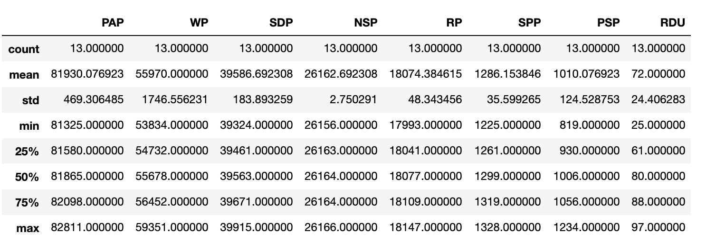

Figure 1: Statistics obtained with describe() function

From the statistics obtained, there are some interesting points to pick out. 

1. Standard Deviation
    - WP has the largest standard deviation at 1746.56, suggesting that the change in followers count is largest
    - On the contrary, NSP has the smallest standard deviation at 2.75 which suggests that there is minimal change in their followers count

Most of the statistics given in Figure 1 are not useful in this context but we can make use of the min and max to find out how much each party gained or lost.

---

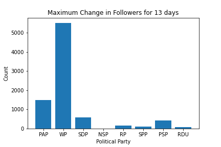

Figure 2: Maximum Change in followers for all 8 parties

From this bar chart, we can see that that the results are aligned with the standard deviation results obtained where WP has the largest change (around 5,500) and NSP has the smallest change (close to 0)

### 3.1 Trends for Each Party

The over-arching trend for all parties is that it increases over time and most see a gradual increase at the start while a steep increase can be observed in the later part. 

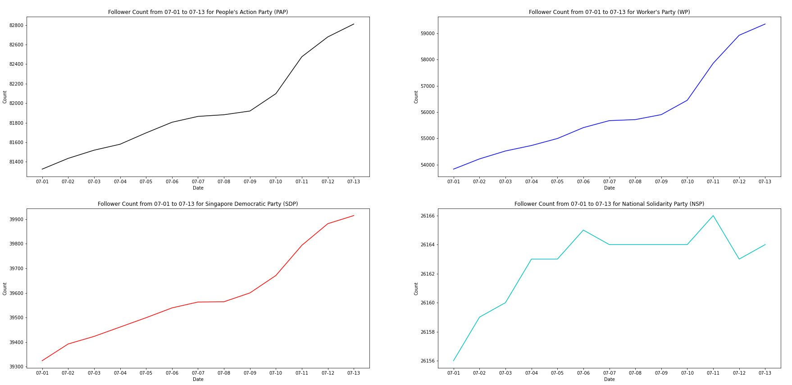

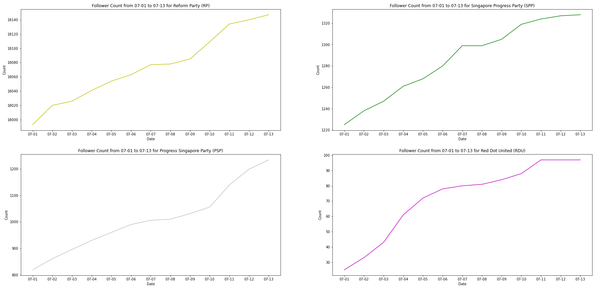

### Comparing between across parties for each day

Trend 1: Worker's Party consistently has the largest increase everyday with its largest increase being 1407 on 11 July 2020, right after the Election ended. This can be attributed to the results of the Election where WP was announced to have clinched a historic win with Aljunied GRC, Sengkeng GRC and xx SMC. This totalled the number of WP' MPs to 9.

Trend 2: PAP boosts the second highest increase everyday too with increases as high as 378 and as low as 17. 

Trend 3: SDP is also quite consistent in the 3rd place after WP and PAP with increases in the range of 30+ to 100+. 

Trend 4: Unusually low for all parties on 8 July — no idea why, cooling off period approaching? Less campaigning? 

Trend 5: Highest for all on 11 July — results of elections announced early morning 11 July

Trend 6: 2nd highest on 10 July — polling day?

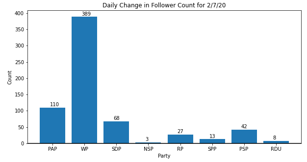

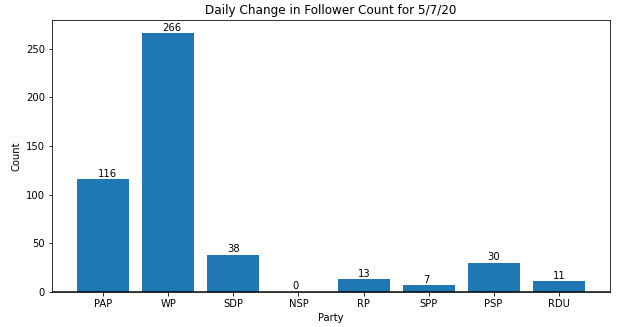

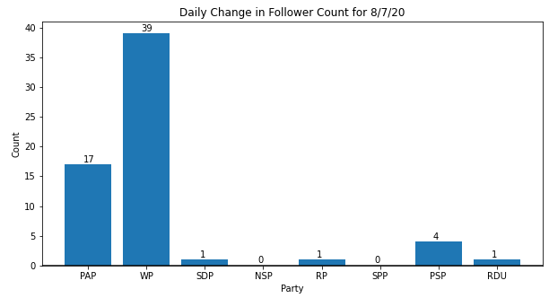

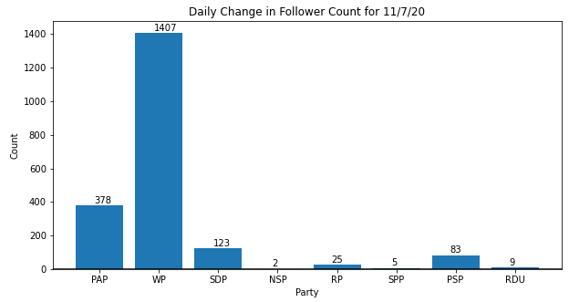

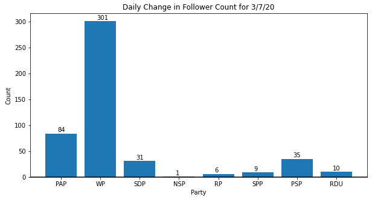

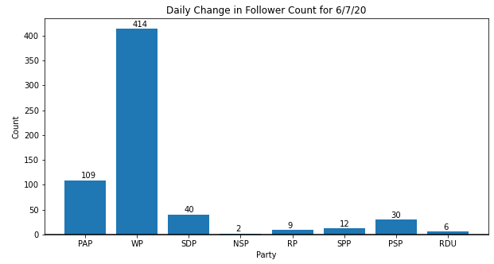

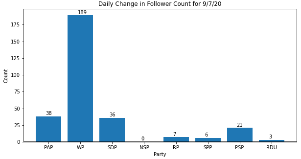

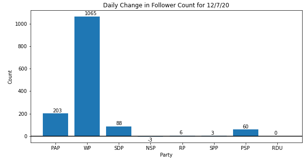

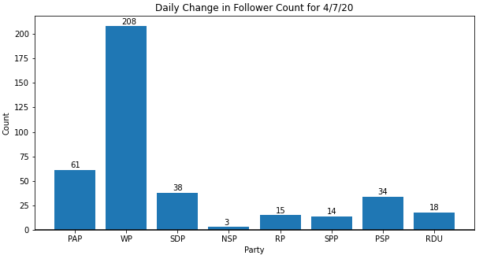

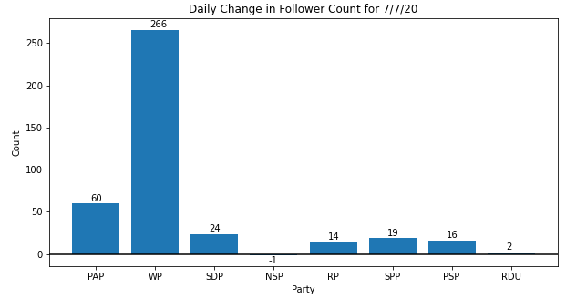


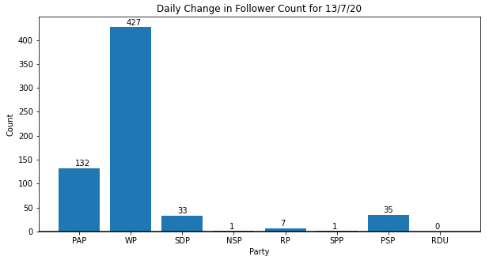

### Comparing between days for each party

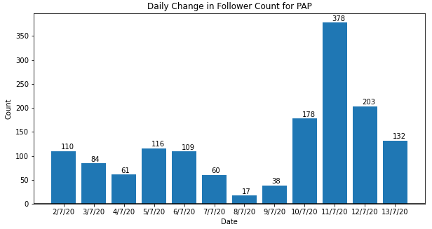

**Analysis for PAP**

There is a downward trend from 2nd July till 9 July where it shoots up again from 10 July onwards, peaking at 11 July

Highest: 378 

Lowest: 17

Interesting Note: Follower increase after Polling Day are all greater than before Polling Day

---

**Analysis for WP**

There is also a downward trend from he start till 8 July where it sees the lowest increase. Same trend as PAP where the increase shoots up from  9 July onwards, peaking on 11 July at 1407. After Polling Day, the increase are all greater than the max of before Polling Day

Highest: 1407

Lowest: 39

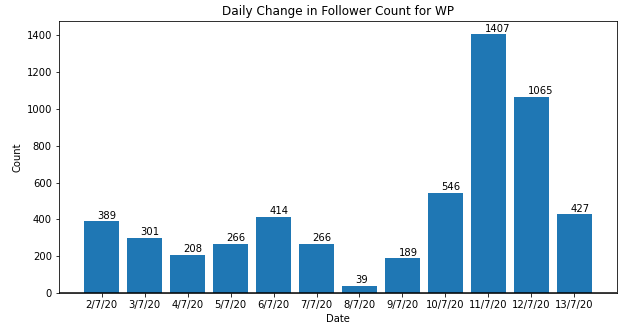

---


**Analysis for SDP**

There is also a downward trend from the start till 8 July where it sees the lowest increase at 1. Same trend as PAP where the increase shoots up from  9 July onwards, peaking on 11 July at 1407. After Polling Day, the increase are all greater than the max of before Polling Day

Highest: 123

Lowest: 1

---

**Analysis for NSP**

There is also a downward trend from the start till 7 July where it sees the lowest increase at -1. It remained at 0 increase for 3 consecutive days on 8, 9, 10 July. On 11 July, it managed to gain 2 followers but on 12th, they lost 3 followers 

Highest: 3

Lowest: -3

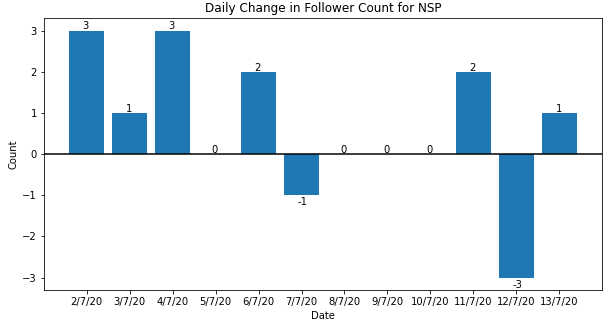

---

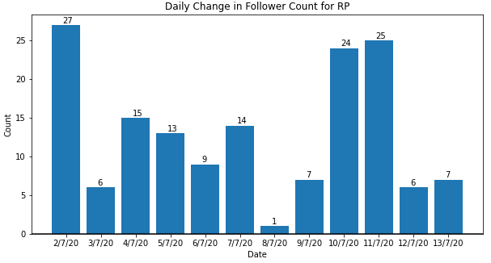

**Analysis for RP**

Same downward trend towards 8th July where it increased after peaking on 11 July at 25 increase. 

---

Analysis for SPP

Same downward trend towards 8th July where it increased after peaking on 11 July at 14 increase. 

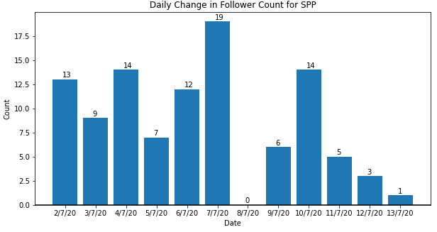

---

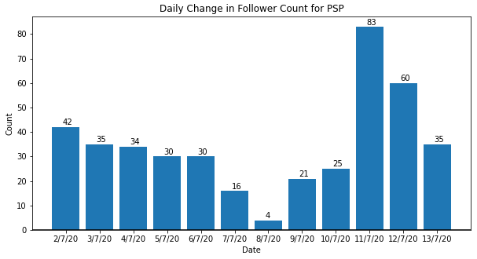

Analysis for PSP

Same downward trend towards 8th July where it increased after peaking on 11 July at 83 increase. 

---

Analysis for RDU

Same downward trend towards 8th July where it increased after peaking on 11 July at 9 July

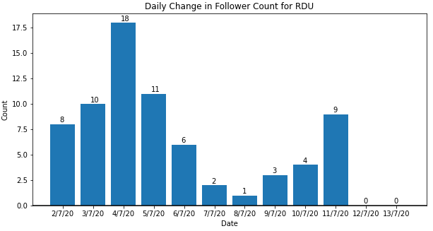

